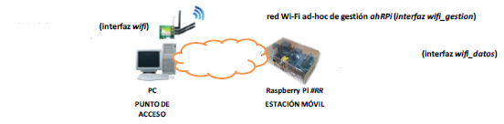
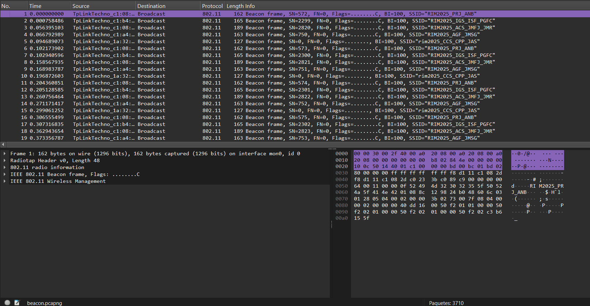
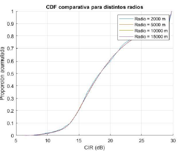

# Wireless Network Engineering


Deployment, analysis and simulation of modern wireless communication systems using **IEEE 802.11, LoRaWAN and GSM** technologies.

This repository documents a complete wireless networking project developed during a Telecommunications Engineering degree. It combines practical laboratory deployments with mathematical simulations to study the behavior, performance, and optimization of modern wireless communication systems.

---

<p align="center">

</p>

---

# Contents

- Project Overview
- Features
- Technologies
- Engineering Workflow
- Repository Structure
- Documentation
- Project Highlights
- Learning Outcomes
- Repository Contents
- Repository Statistics
- License

---

# Project Overview

The repository covers three complementary areas of wireless communications engineering, progressing from local wireless networking to Internet of Things (IoT) infrastructures and large-scale cellular planning.

The project combines theoretical concepts with practical implementation through laboratory experiments, protocol analysis, telemetry monitoring, and mathematical simulation.

The implemented modules include:

- **IEEE 802.11 Wireless Local Area Networks (WLANs)**
- **LoRaWAN Low-Power Wide-Area Networks (LPWANs)**
- **GSM Cellular Frequency Planning**
- **Wireless Traffic Analysis**
- **Real-Time Telemetry Monitoring**
- **Carrier-to-Interference Ratio (CIR) Simulation**
- **Dynamic Frequency Allocation Algorithms**

---

# Features

- IEEE 802.11 Access Point deployment using Linux
- Manual wireless interface configuration
- WPA/WPA2 authentication
- Wireless spectrum analysis
- IEEE 802.11 packet capture and inspection
- LoRaWAN infrastructure deployment
- Secure OTAA device provisioning
- ChirpStack Network & Application Server configuration
- Docker-based backend deployment
- InfluxDB and Grafana integration
- RSSI and SNR monitoring
- GSM frequency reuse simulation
- Carrier-to-Interference Ratio (CIR) evaluation
- Game Theory-based channel allocation
- MATLAB numerical simulations

---

# Technologies

| Category | Technologies |
|-----------|--------------|
| Wireless Networks | IEEE 802.11, LoRaWAN, GSM |
| Programming | MATLAB |
| Operating System | Ubuntu Linux, Raspberry Pi OS |
| Wireless Configuration | Hostapd, WPA Supplicant |
| Packet Analysis | Wireshark, Kismet, inSSIDer |
| IoT Platform | ChirpStack |
| Monitoring | Grafana |
| Database | InfluxDB |
| Containerization | Docker |

---

# Engineering Workflow

```text
IEEE 802.11 Deployment
          │
          ▼
Wireless Traffic Analysis
          │
          ▼
LoRaWAN Telemetry
          │
          ▼
GSM Simulation
          │
          ▼
Wireless Network Evaluation
```

Each module builds upon the previous one, combining practical experimentation with analytical evaluation to better understand wireless communication systems.

---

# Repository Structure

```text
wireless-network-engineering/
│
├── docs/
│   ├── 01-project-overview.md
│   ├── 02-ieee-80211-network.md
│   ├── 03-lorawan-iot.md
│   └── 04-gsm-frequency-reuse.md
│
├── scripts/
│   ├── matlab/
│   │   ├── channelallocation.m
│   │   ├── PRUEBA.m
│   │   ├── reuse.m
│   │   └── rng.m
│   │
│   └── dashboards/
│       └── 1744362274480.json
│
├── config/
│   ├── hostapd.conf
│   └── wpa_supplicant.conf
│
├── pcaps/
│   └── beacon.pcapng
│
├── screenshots/
│   ├── wifi/
│   ├── lorawan/
│   └── gsm/
│
├── README.md
└── LICENSE
```

---

## Documentation

The repository documentation is organized into four technical modules:

| Document | Description |
|----------|-------------|
| [01 - Project Overview](docs/01-project-overview.md) | Project scope, objectives, repository organization, and engineering workflow. |
| [02 - IEEE 802.11 Network](docs/02-ieee-80211-network.md) | Wi-Fi deployment, wireless security, spectrum analysis, and packet inspection. |
| [03 - LoRaWAN IoT](docs/03-lorawan-iot.md) | LPWAN deployment, OTAA provisioning, ChirpStack configuration, Docker services, and telemetry monitoring. |
| [04 - GSM Frequency Reuse](docs/04-gsm-frequency-reuse.md) | Cellular planning, Carrier-to-Interference Ratio analysis, MATLAB simulations, and Game Theory channel allocation. |

---

# Engineering Workflow

The project follows the workflow illustrated below:

```text
IEEE 802.11 Deployment
          │
          ▼
Wireless Traffic Analysis
          │
          ▼
LoRaWAN Telemetry
          │
          ▼
GSM Simulation
          │
          ▼
Wireless Network Evaluation
```

Each module builds upon the previous one, combining practical deployment with analytical evaluation to better understand modern wireless communication systems.

---

# Project Highlights

## IEEE 802.11 Wireless Networking

Deployment and validation of a Linux-based IEEE 802.11 wireless infrastructure, including Access Point configuration, client authentication, spectrum analysis, and packet inspection.

<p align="center">

</p>

---

## LoRaWAN Infrastructure and IoT Telemetry

End-to-end deployment of a LoRaWAN telemetry platform using ChirpStack, Docker, InfluxDB, and Grafana for real-time monitoring of RSSI and SNR metrics.

<p align="center">

</p>

---

## GSM Cellular Network Planning

MATLAB-based simulation of GSM cellular deployments to evaluate Carrier-to-Interference Ratio (CIR), frequency reuse strategies, and Game Theory-based channel allocation.

<p align="center">

</p>

---

# Learning Outcomes

Through the development of this project, the following practical skills were acquired:

- Deployment and configuration of IEEE 802.11 wireless networks using Linux.
- Configuration of Hostapd and WPA Supplicant for wireless communication.
- Wireless traffic analysis through Wireshark and Kismet.
- Packet capture and IEEE 802.11 management frame inspection.
- Deployment of LoRaWAN infrastructures using ChirpStack.
- Docker container orchestration for IoT services.
- Integration of InfluxDB and Grafana for telemetry visualization.
- Analysis of RSSI and SNR under different propagation scenarios.
- Mathematical simulation of GSM cellular networks using MATLAB.
- Evaluation of Carrier-to-Interference Ratio (CIR) under different frequency reuse factors.
- Implementation of Game Theory algorithms for dynamic channel allocation.

---

# Repository Contents

The repository includes:

- Technical documentation
- MATLAB simulation scripts
- Grafana dashboard templates
- Linux wireless configuration files
- IEEE 802.11 packet captures
- Laboratory screenshots
- Network architecture diagrams

---

# License

This project is distributed under the **MIT License**.

See the **LICENSE** file for additional information.
