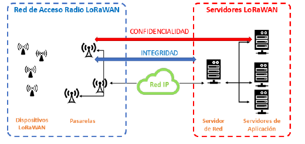
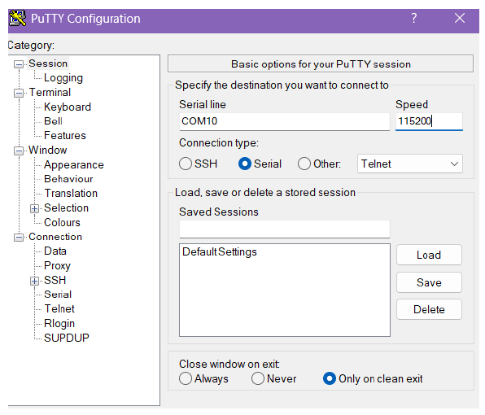
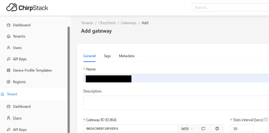
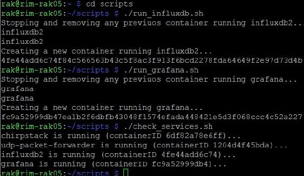
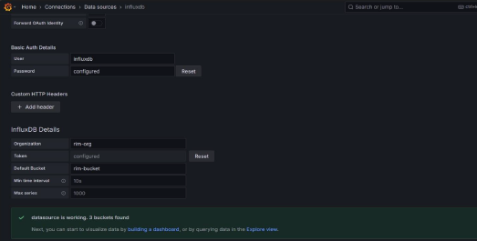
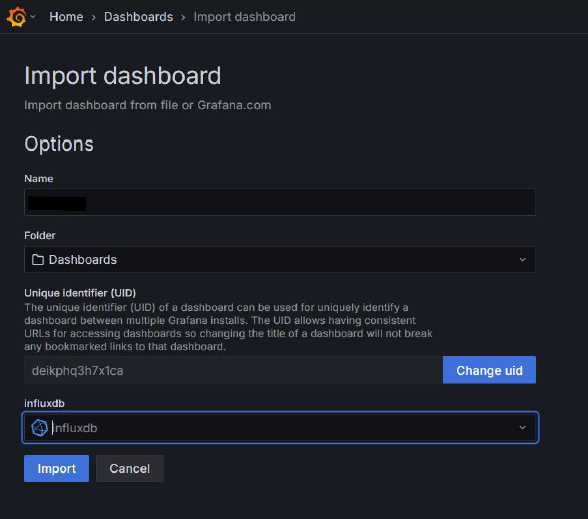
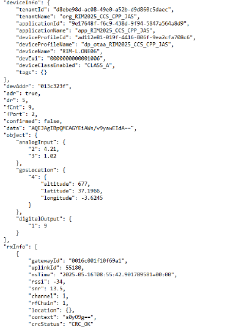
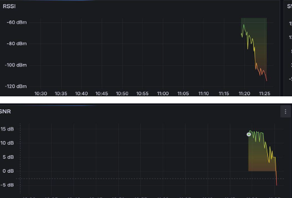

# LoRaWAN Infrastructure and IoT Telemetry

## Overview

This module focuses on the deployment, configuration, and performance evaluation of a complete Low-Power Wide-Area Network (LPWAN) based on LoRaWAN technology. Designed for Internet of Things (IoT) applications, LoRaWAN enables long-range wireless communication while maintaining extremely low power consumption, making it suitable for battery-powered devices deployed over large geographic areas.

The project implements a complete end-to-end telemetry pipeline, beginning with data acquisition from an IoT end-device and continuing through the gateway, network server, application server, time-series database, and visualization platform. The deployment demonstrates how telemetry data can be securely collected, processed, stored, and monitored in real time.

---

# Objectives

The main objectives of this module are:

- Deploy a complete LoRaWAN infrastructure including end-devices, gateway, network server, database, and visualization platform.
- Configure secure device authentication using Over-The-Air Activation (OTAA).
- Deploy the backend infrastructure using Docker containers.
- Integrate ChirpStack, InfluxDB and Grafana into a unified telemetry platform.
- Monitor wireless communication performance using RSSI and SNR measurements.
- Evaluate network coverage under indoor, outdoor and mobility scenarios.

---

# LoRaWAN Architecture

The laboratory deployment follows the standard LoRaWAN star-of-stars architecture.

IoT end-devices transmit encrypted LoRa frames to a LoRaWAN gateway. The gateway operates as a transparent bridge, forwarding packets to the ChirpStack Network Server through an IP network. ChirpStack authenticates devices, manages network sessions, decodes payloads, and forwards telemetry information to InfluxDB, where time-series data is stored.

Grafana connects directly to InfluxDB to generate dashboards for monitoring network performance and signal quality in real time.

<p align="center">

</p>

---

# Hardware and Software Environment

## Hardware Components

The deployed laboratory infrastructure includes:

- LoRaWAN End-Node (Mote) configured to periodically transmit telemetry packets.
- LoRaWAN Gateway connected to the local wireless network using a static IPv4 address.
- Raspberry Pi platform hosting the gateway services.
- USB serial connection for end-device provisioning.

## Software Components

The software stack consists entirely of open-source technologies:

- ChirpStack Network Server
- ChirpStack Application Server
- Docker
- InfluxDB
- Grafana
- PuTTY
- Ubuntu Linux

---

# Device Provisioning

The LoRaWAN end-device was configured through a serial connection using PuTTY.

The mote periodically transmits telemetry messages every 20 seconds and operates using:

- LoRaWAN 1.0.3
- EU868 frequency band
- Class A operation
- OTAA activation
- Spread Factor 7 (SF7)

Each device is uniquely identified by its DevEUI while authentication is performed dynamically through the OTAA join procedure.

<p align="center">

</p>

---

# ChirpStack Configuration

ChirpStack acts as the central management platform for the LoRaWAN infrastructure.

The deployment process consists of:

1. Creating a tenant.
2. Registering the LoRa gateway.
3. Creating the application.
4. Defining the device profile.
5. Registering the end-device.
6. Configuring OTAA activation.
7. Selecting the EU868 regional parameters.
8. Enabling Cayenne LPP payload decoding.

Once the device successfully joins the network, ChirpStack manages packet decryption, session keys and application data routing.

<p align="center">

</p>

---

# Docker Deployment

All backend services are deployed as isolated Docker containers.

The containerized environment includes:

- ChirpStack
- UDP Packet Forwarder
- InfluxDB
- Grafana

Containerization simplifies deployment, improves reproducibility, and isolates individual services from the host operating system.

<p align="center">

</p>

---

# Telemetry Pipeline

The telemetry processing pipeline follows the sequence below:

```text
IoT End-Device
        │
        ▼
LoRaWAN Gateway
        │
        ▼
ChirpStack Network Server
        │
        ▼
InfluxDB
        │
        ▼
Grafana Dashboards
```

This architecture enables real-time acquisition, storage and visualization of wireless sensor data.

---

# InfluxDB and Grafana Integration

ChirpStack forwards decoded telemetry data directly to InfluxDB using its built-in integration mechanism.

Grafana is configured to use InfluxDB as its data source, allowing telemetry metrics to be visualized through a predefined dashboard imported from:

```
scripts/dashboards/1744362274480.json
```

The dashboard continuously displays received telemetry without requiring manual data processing.

<p align="center">

</p>

<p align="center">

</p>

---

# Telemetry Monitoring

Following successful OTAA authentication, the end-device begins transmitting encrypted LoRaWAN frames.

ChirpStack automatically decodes each received packet and exposes the telemetry data through its web interface.

The monitored parameters include:

- RSSI (Received Signal Strength Indicator)
- SNR (Signal-to-Noise Ratio)
- Frame Counter
- Device identifiers
- Geographic coordinates decoded using Cayenne LPP

These metrics provide continuous insight into link quality and communication reliability.

<p align="center">

</p>

---

# Performance Evaluation

Network performance was experimentally evaluated under several operating conditions.

## Indoor Multi-Floor Testing

Measurements were collected on multiple floors while maintaining the gateway in a fixed position.

As expected, increasing vertical separation and additional building structures produced lower RSSI values and reduced SNR.

## Outdoor Static Testing

Two outdoor locations were evaluated:

- Near the building with clear line-of-sight.
- Distant location with multiple obstacles.

The nearby position maintained excellent signal quality, whereas the obstructed location experienced significantly reduced reception.

## Mobility Testing

The end-device was gradually moved approximately 400 meters away from the gateway.

Grafana dashboards clearly showed the progressive degradation of RSSI and SNR until communication was completely lost at the edge of the coverage area.

<p align="center">

</p>

---

# Design Decisions

Several engineering decisions were adopted throughout the deployment.

**Spread Factor 7 (SF7)**

SF7 was selected to maximize transmission speed while maintaining sufficient communication reliability for laboratory testing.

**OTAA Authentication**

OTAA was chosen instead of ABP because it dynamically generates session keys and provides a more secure and scalable authentication mechanism.

**Docker-Based Deployment**

Containerizing all backend services improves reproducibility, simplifies maintenance, and allows independent service management.

**Grafana for Visualization**

Grafana provides a flexible platform for monitoring LoRaWAN telemetry in real time through customizable dashboards.

---

# Summary

This module demonstrates the deployment of a complete LoRaWAN telemetry infrastructure, integrating wireless IoT devices with modern monitoring and data analytics platforms.

Using ChirpStack, Docker, InfluxDB, and Grafana, the project implements a secure and scalable telemetry pipeline capable of collecting, storing, and visualizing sensor data in real time.

The experimental evaluation validates LoRaWAN propagation characteristics under indoor, outdoor, and mobility scenarios, highlighting the influence of distance and physical obstacles on RSSI and SNR measurements while demonstrating the suitability of LPWAN technologies for long-range IoT communications.
